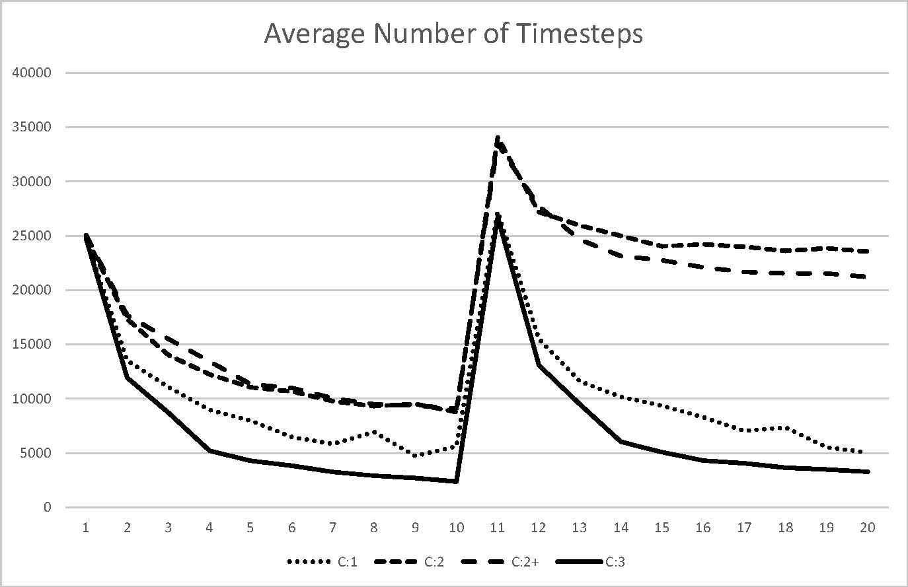
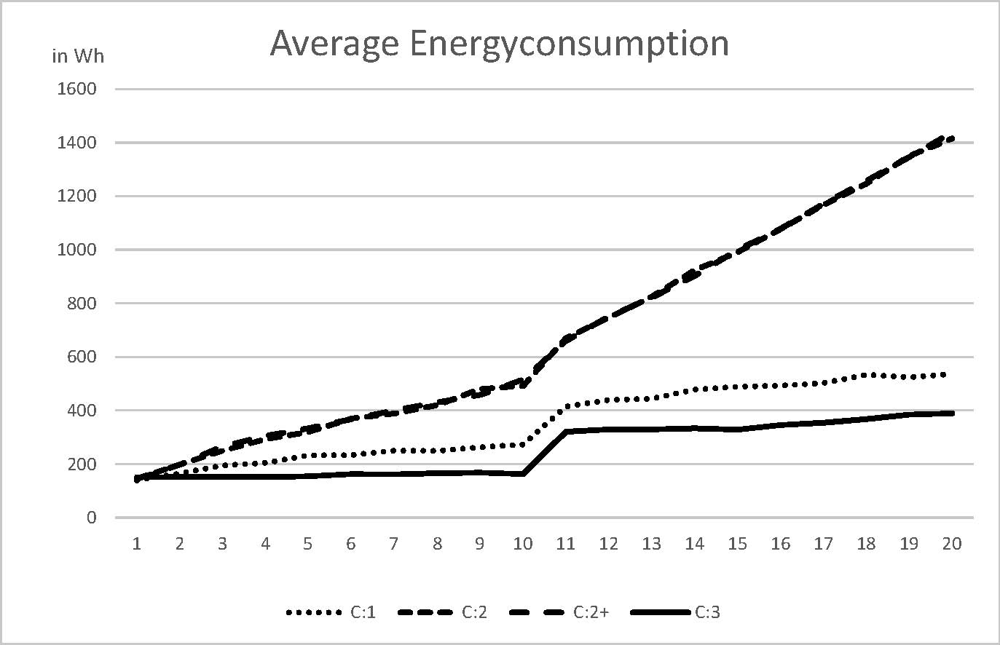
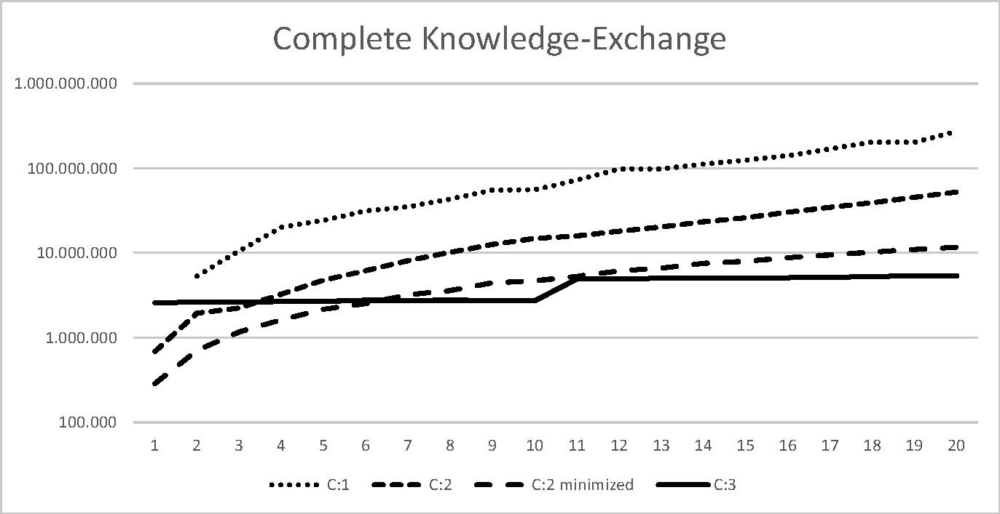

# Evaluation Step-by-Step

This guide shows a Step-by-Step example to configure a simulation and look at the outcome. The example used here is a minimal one which means that it is faster than some other simulation examples. 

## 1. Configure a Simulation

At the main page of the GUI you can configure all information that SAKE could handle.

1. At first, we configure the used map for the first test we choose the <b>"Quadratic Map"</b>.

2. To get one simulation run which goes very fast we choose the second strategy <b>"Complete controlling Master"</b>.

3. As number of agents we choose <b>7 "Explore Agents"</b>, <b>5 "Vacuum (Hoover) Agents"</b> and <b>0 "Wiper Agents"</b>.

4. To see what the agents do we also activate the <b>"PNG Save"</b> to get an outcome of the local models of each agent and the "Graphical user interface" to see it in the GUI. 

If we deactivate the GUI the hole simulation runs faster but it is easier to locate bottlenecks at run times by seeing the moving of each agent.

For more runs at the same time it is possible to create an XML File like (Siafu-Sake-Simulator/Simulations/SAKE-Framework/Configuration/SimulationInformation.xml) and give it on start to the program. This will extract all configs from the file and run them after one another.

## 2. Start a Simulation

To start the simulation, choose <b>"Simulation->Open unpacked Simulation"</b> and choose the File <b>"simulations/SAKE-Framework-1.0.6-SNAPSHOT.jar"</b>. The simulations with the predefined configuration will start now.

## 3. Evaluation output data

As an outcome, text files will be created in the result folder and image files in the dump/png folder. The picture show in this configuration that only the master gets more data in his local model because the other agents only send their new information to the master and do not save it on their own.

In the result folder, the measurement data about the energy consumption and needed time of each agent is saved. And one document has all information about each data exchange between two agents.

To reuse this information all data is saved in JSON format and could easily be read by a program to create diagram of specific values on the fly. The tool to do this is not well implemented but however could be implemented of everyone on their own. 

## 4. Example output from more runs

Here you see some output diagrams of the overall needed time, energy consumption and knowledge exchange. Therefore, we make 5 runs with each configuration and visualize the outcoming data in this diagrams.

<b>Fig1. - Average number of time steps on the hall map.</b>

<b>Fig2. - Average energy consumption on the hall map.</b>

<b>Fig3. - Average knowledge exchange on the hall map.</b>

